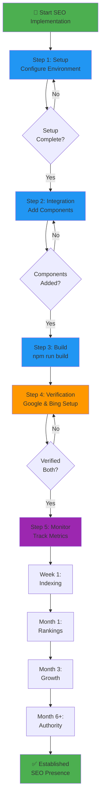
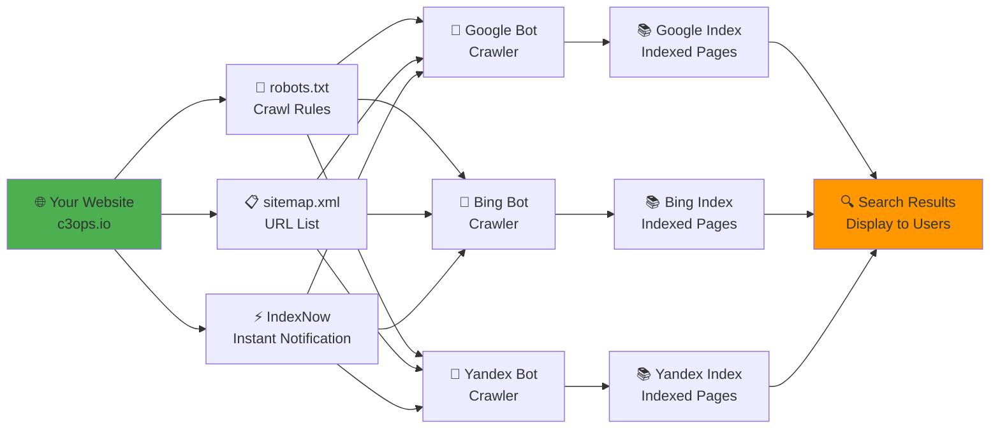
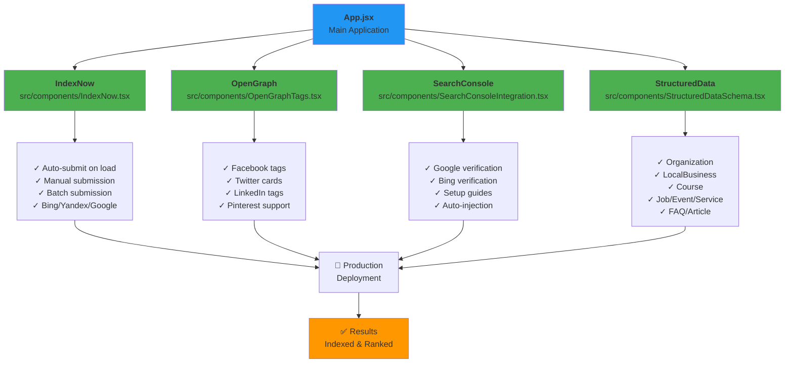
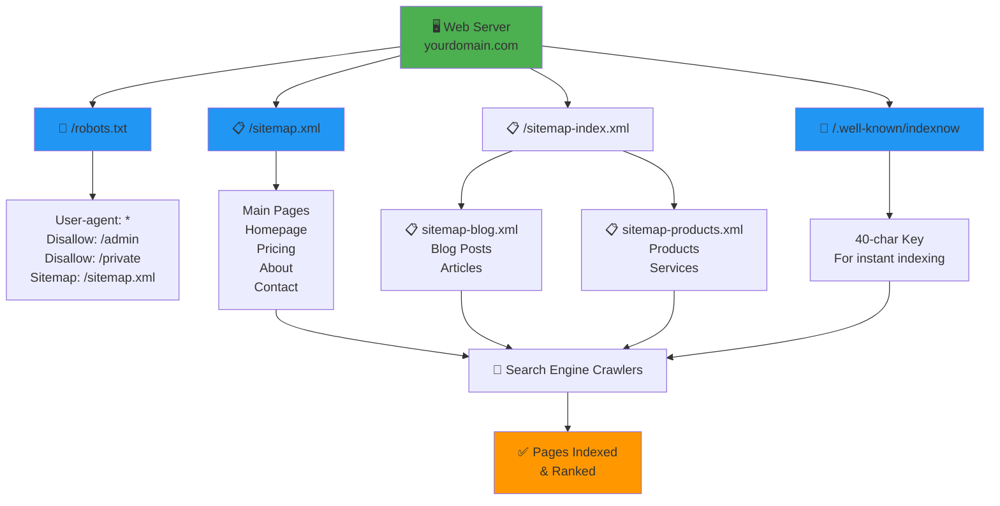
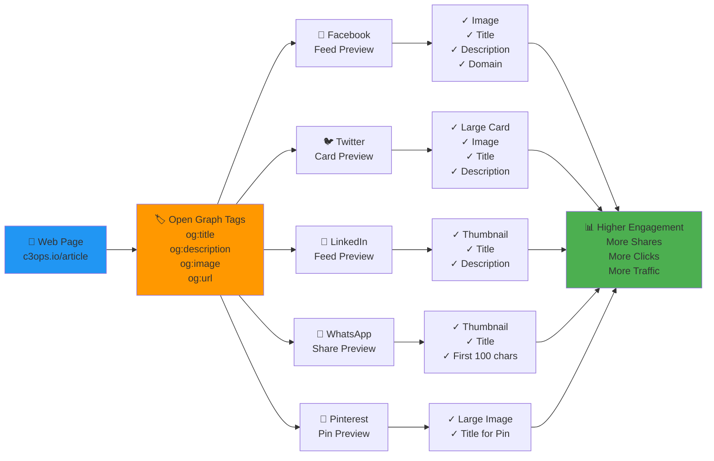
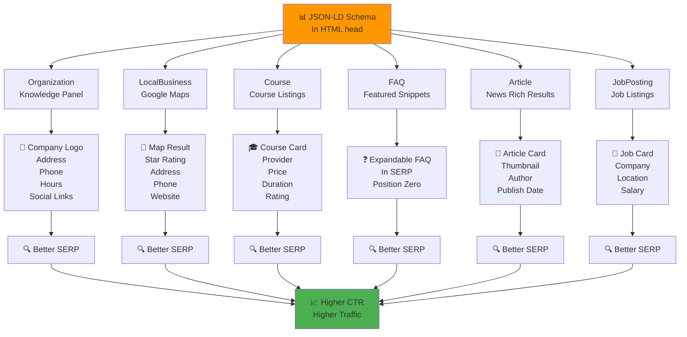
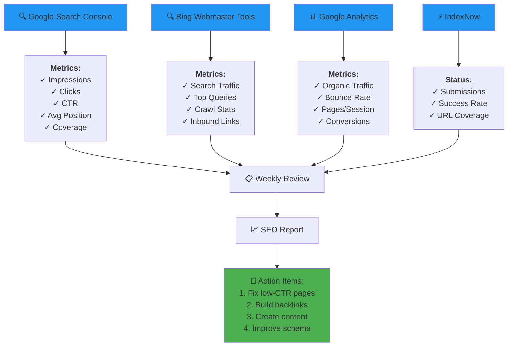
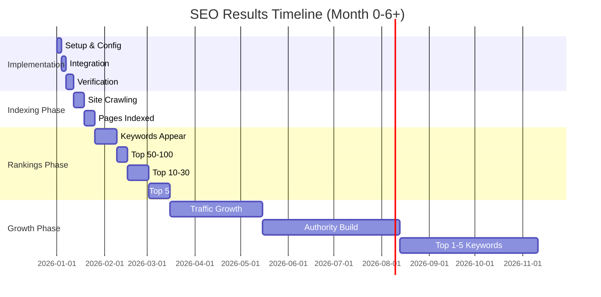
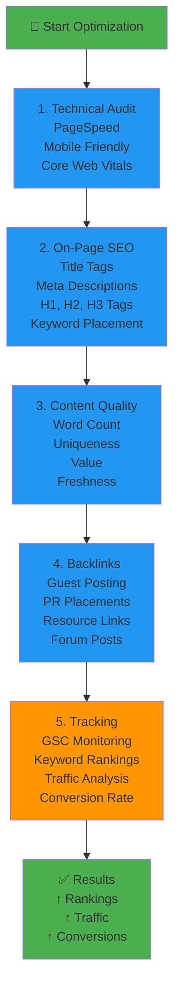
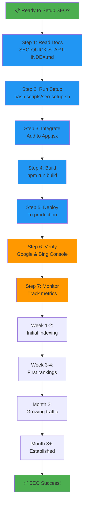

# SEO Visual Guide & Process Diagrams

**Last Updated:** March 17, 2026  
**Platform:** C3OPS FinOps Platform  
**Format:** Mermaid Diagrams

---

## 1. SEO Implementation Workflow



---

## 2. Search Engine Discovery & Indexing



---

## 3. SEO Components Architecture



---

## 4. Sitemap & Robots.txt Strategy



---

## 5. Open Graph & Social Media Preview



---

## 6. Structured Data & Rich Snippets



---

## 7. SEO Monitoring Dashboard



---

## 8. SEO Timeline & Results Progression



---

## 9. Optimization Checklist Flow



---

## 10. Quick Setup Flowchart



---

## Key Statistics & Expected Results

### Week 1: Crawling & Indexing
```
Sites Indexed: 50-80% of pages
Search Impressions: Minimal (0-100)
Ranking Positions: Not yet
Expected Action: Monitor crawl errors
```

### Week 2-4: Initial Rankings
```
Sites Indexed: 80-95% of pages
Ranking Positions: #50-100
Search Traffic: 0-500 visits
Expected Action: Optimize titles, descriptions
```

### Month 2: Growing Rankings
```
Ranking Positions: #10-30
Search Impressions: 1,000-10,000
Search Traffic: 100-2,000 visits
Featured Snippets: 10-20% of keywords
Expected Action: Create more content, build backlinks
```

### Month 3+: Established Presence
```
Ranking Positions: Top 10
Search Traffic: 1,000-10,000+ visits/month
Featured Snippets: 20%+ of keywords
Organic Growth: Accelerating
Expected Action: Dominate niches, expand content
```

### Month 6+: Authority
```
Ranking Positions: #1-5 for main keywords
Organic Traffic: 2-5x initial
Domain Authority: Growing
Featured Snippets: 30%+
Expected: Sustainable, predictable growth
```

---

**Visual Reference Complete!**

For text-based detailed guidance, see: SEO-DIGITAL-MARKETING-COMPLETE-GUIDE.md  
For quick checklists, see: SEO-CHECKLIST-AND-TIMELINE.md  
For implementation steps, see: SEO-IMPLEMENTATION-SUMMARY.md
